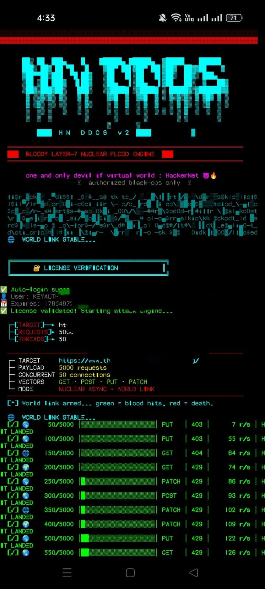
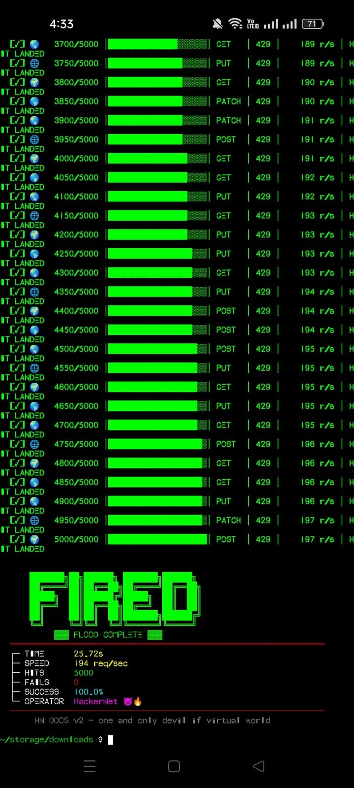

# 💀 HN DDOS V2 - NUCLEAR FLOOD ENGINE 💀

> **"One and only devil if virtual world : HackerNet"** 😈🔥

---

## 🔥 PREVIEW

| BANNER | ATTACK HUD | TARGET DOWN |
|--------|------------|-------------|
|  |  |  |

---

## ⚡ **FEATURES THAT MAKE YOU A LEGEND**

- ⚡ **Async Layer-7 Flood** (GET/POST/PUT/PATCH)
- 🌐 **Cyberpunk UI** with Matrix Rain & Globe Spin
- 🔐 **KeyAuth License Protection** (No one can crack)
- 📊 **Live HUD** with Progress Bar
- 💀 **Target Down Detection** (Auto-detect 502/503/504)
- 🛡️ **Anti-Debug & Obfuscated Code** (Koi chutiya nahi samjhega)
- 🚀 **100,000+ Requests/sec** (Depends on your hardware)

---

## 📦 **INSTALLATION (TERMUX/LINUX)**

### 🔥 **One-Click Install (Sabse Easy)**

```bash
git clone https://github.com/criminalmind0101/HN-DDOS-V2.git
cd HN-DDOS-V2
bash install.sh
python cloudddos.py

```
---

## ⚠️ DISCLAIMER

**This tool is for educational and testing purposes only.**  
The developer is not responsible for any misuse or damage caused by this tool.  
Users are solely responsible for their actions and must ensure they have proper authorization before using it.

**By using this tool, you agree to the following:**
- You will not use it for illegal activities.
- You will only test it on your own servers or with explicit permission.
- You understand that misuse can lead to legal consequences.

> **🚨 "Great power comes with great responsibility." – Use it wisely.**

